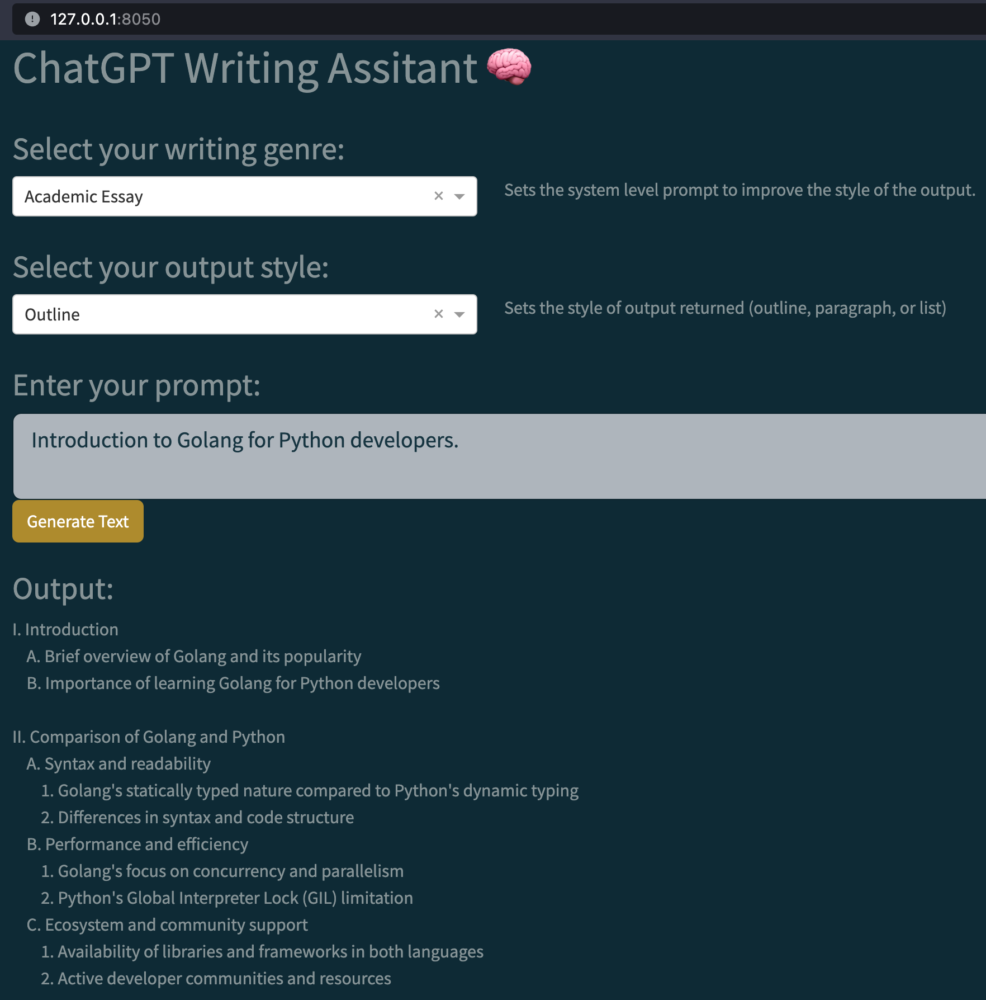

# Dash ChatGPT Writing Assistant 🧠

A basic writing assistant app in pure Python using ChatGPT and Dash.

An async extension of [ChatGPT-dash-app](https://github.com/bendgame/ChatGPT-dash-app/tree/main) to include `simpleaichat` implementation.

## Features

- [x] Writing style
- [x] Output style: {outline, paragraph, list}
- [x] `simpleaichat` integration
- [x] `loguru` logging

